# CSS Grid System
**CSS Grid System** es una nueva forma de generar esquemas web, algo parecido a **flexbox**, pues la mayoría de sus propiedades se aplican en el *parent container* y se afecta a los *children* del mismo.

Pero con la diferencia de que ahora se crea de manera explícita filas y columnas. Algo que hasta el momento era prácticamente imposible con propiedades nativas de CSS.

---

## Temario <a name="temario"></a>

1. [Creando un grid container](#creando-un-grid-container)
2. [Creando columnas con CSS grid](#creando-columnas-con-css-grid)
3. [Creando filas con CSS grid](#creando-filas-con-css-grid)
4. [Espaciado entre columnas y filas](#espaciado-entre-elementos)
5. [Tamaño mínimo y máximo de columnas y filas](#tamaño-mínimo-y-máximo-de-filas-y-columnas)
6. [Repitiendo columnas y filas](#repitiendo-columnas-y-filas)
7. [Posicionamiento de elementos](#posicionamiento-de-elementos)
8. [Grid Areas](#grid-areas)
9. [Alineación de elementos](#alineación-de-elementos)
10. [Alineación de track](#alineación-de-tracks)
11. [Grid flow](#grid-flow)
12. [Auto Fill & Auto Fit](#auto-fill-fit)
13. [Demos](./demos)

---

## 1. Creando un Grid Container <a name="creando-un-grid-container"></a>
Para que un *parent container* se convierta en un *grid container* se hace necesario aplicar la siguiente línea de código:

```css
display: grid;
```

[ volver al temario](#temario)

---

## 2. Creando columnas con CSS Grid <a name="creando-columnas-con-css-grid"></a>
Para poder crear columnas dentro de un *parent container* es necesario usar la siguiente propiedad:

```css
grid-template-columns: A B C;
```

En donde `A B C` pueden ser valores expresados en `px`, `%` ó `fr` (fracción o porción de contenido). Por ejemplo el siguiente código:

```css
grid-template-columns: 200px 200px 200px;
```

Creará una grilla de 3 columnas, cada una con `200px` de ancho.

*Ejemplo:*


Por el contrario la siguiente declaración:

```css
grid-template-columns: 1fr 1fr 1fr;
```

Creará una grilla de 3 columnas así:

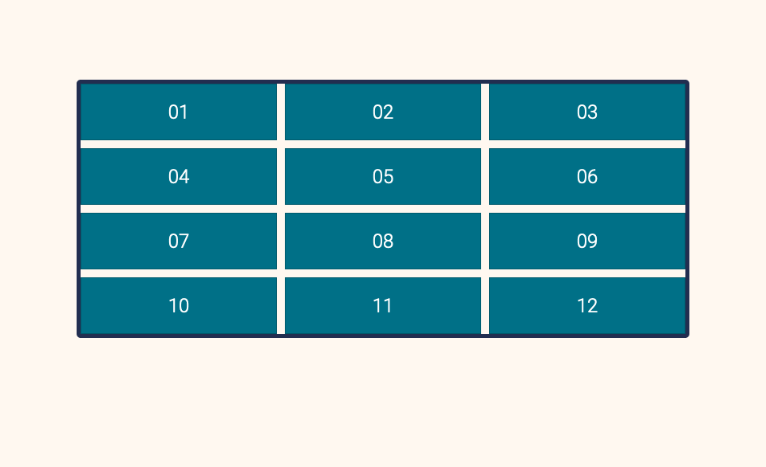

Se debe tener en cuenta que si se escibren valores expresados en `px`, los mismos serán **absolutos** y dicho *children* no modificará su tamaño al momento de aplicar *"responsive"* a su *parent container*.

[ volver al temario](#temario)

---

## 3. Creando filas con CSS Grid <a name="creando-filas-con-css-grid"></a>
Para poder crear filas dentro de un *parent container* es necesario usar la siguiente propiedad:

```css
grid-template-rows: A B C;
```

En donde `A B C` serán valores expresados en `px`. Por ejemplo el siguiente código:

```css
grid-template-rows: 150px 250px;
```

Creará dos filas, la primera con `150px` de alto y la segunda con `250px` de alto.

*Ejemplo:*

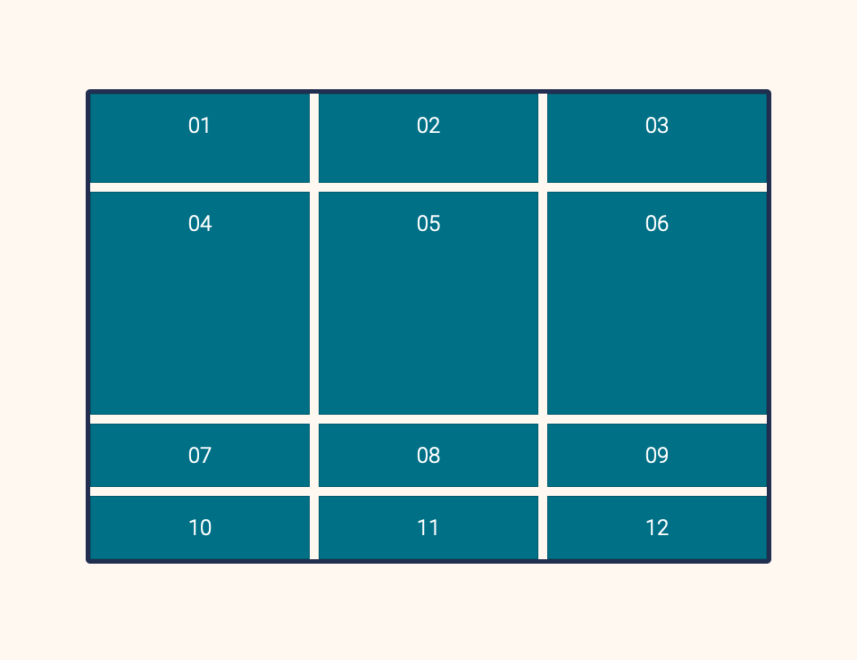

**¿Qué pasa con el resto de elementos?**

> Los mismos se ubicarán en las filas sub siguientes, las cuales tendrán un alto automático que dependerá de su *inner content* (contenido interno).

Se debe tener en cuenta que los valores dentro de esta propiedad pueden expresarse en `%` ó `fr`, pero para que los mismos surtan efecto, se hace necesario que el *parent container* tengo una altura (`height`) definida en `px`.

[ volver al temario](#temario)

---

## 4. Espaciado entre columnas y filas <a name="espaciado-entre-elementos"></a>
Para separar elementos entre sí, se hace necesario utilizar la siguiente propiedad: 

```css
gap: Npx; /* antes grid-gap */
```

Esta propiedad recien un valor expresado en `px`. El mismo será el espaciado entre filas y columnas.

Vale aclarar que dicho valor no se suma entre columnas y filas. Por ejemplo, si tuvieramos esta declaración:

```css
gap: 20px;
```

El espacio real entre columnas y filas será de `20px` y no de `40px`. 

*Ejemplo con gap:*


*Ejemplo sin gap:*

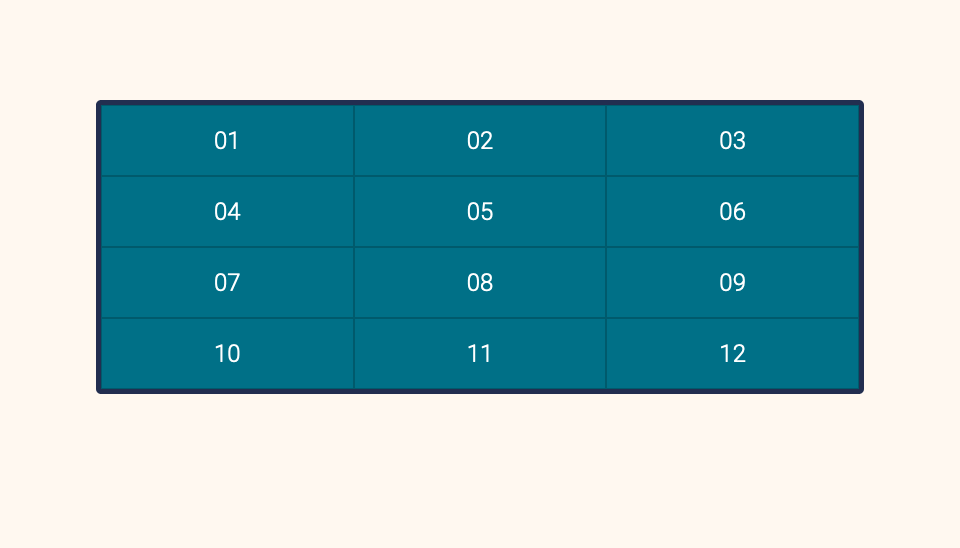

[ volver al temario](#temario)

---

## 5. Tamaño mínimo y máximo de columnas y filas <a name="tamaño-mínimo-y-máximo-de-filas-y-columnas"></a>
En ocasiones se hace necesario definir un tamaño mínimo y máximo para filas y columnas. Para ello es posible utilizar la función `minmax()` como valor de las propiedades `grid-template-columns` y `grid-template-rows`.

```css
grid-template-columns: minmax(100px, 300px) 2fr 1fr;
```

La declaración anterior generará que la primer columna tenga cómo mínimo `100px` de ancho y como máximo `300px`. Dejando a la columna dos con la posibilidad de tomar de ancho 2 fracciones del espacio restante y a la columna tres una fracción del espacio que sobra.

Si bien esta es una buena opción para la columnas, es más comunmente aplicada sobre las filas, pues al hacer esto: `minmax(200px, auto)`. Se está generando una fila con mínimo `200px` de alto, pero con la posibilidad de ampliar su altura según como lo necesite.

[ volver al temario](#temario)

---

## 6. Repitiendo columnas y filas <a name="repitiendo-columnas-y-filas"></a>
En ocasiones es bastante molesto especificar una a una la cantidad de filas y columnas que se desean, por ello, CSS provee la función `repeat(qty, size)`, la cual permite repetir una `N` cantidad de veces columnas y/o filas.

Ésta función: `repeat(qty, size)`, toma dos parámetros. El primero de ellos deberá ser un número entero que representa a la cantidad de columnas que se desean. Mientras que el segundo equivale al tamaño que tendrá cada una de esas columnas.

```css
grid-template-columns: repeat(4, 2fr);
```

La declaración anterior generará 4 columnas de 2 fracciones de tamaño cada una.

**¿Se pueden crear más columnas adicionales?**

> Si. Bastará con definir las mismas, antes o despues de la función `repeat()`.

```css
grid-template-columns: 100px repeat(4, 2fr) minmax(100px, 1fr);
```

[ volver al temario](#temario)

---

## 7. Posicionamiento de elementos <a name="posicionamiento-de-elementos"></a>

Al crear un *grid container*, el navegador renderiza a dicho elemento disponiendo sobre el mismo una rejilla que está divida por varios números tanto verticales como horizontales.

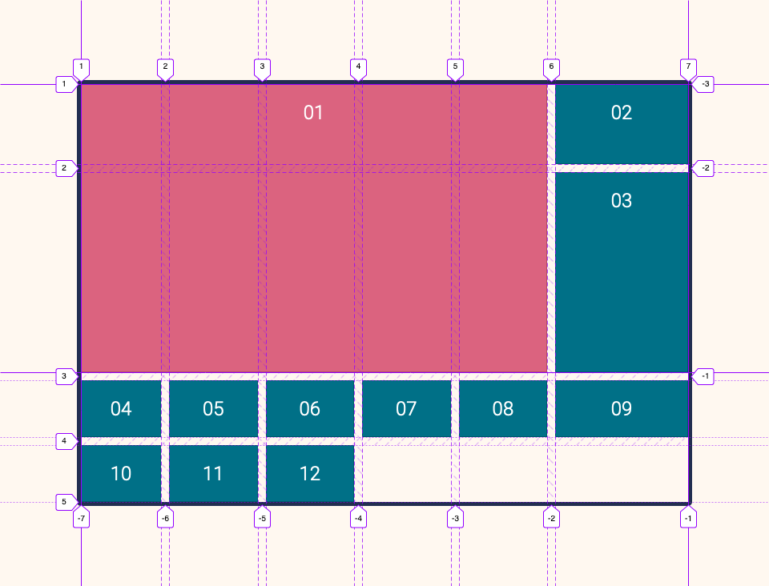

Estos números son fundamentales al momento de querer posicionar un elemento en una determinada fila o columna. Ya que gracias a los mismo, se puede definir donde inicia y termina un elemento a nivel de columnas y a nivel de filas.

Las propiedades necesarias para lograr este posicionamiento son:

```css
/* Posicionamiento a nivel de columnas */
grid-column-start: n;
grid-column-end: n;

/* Posicionamiento a nivel de filas */
grid-row-start: n;
grid-row-end: n;
```

> `n` será un número entero, positivo o negativo que define el inicio y/o el fin del elemento.

Si se tuviera por ejemplo el siguiente *grid container*:

```css
.container {
	display: grid; 
	grid-template-columns: 100px repeat(4, 1fr);
	grid-template-rows: 100px 250px;
	gap: 10px;
}
```

El resultado visual sería así:

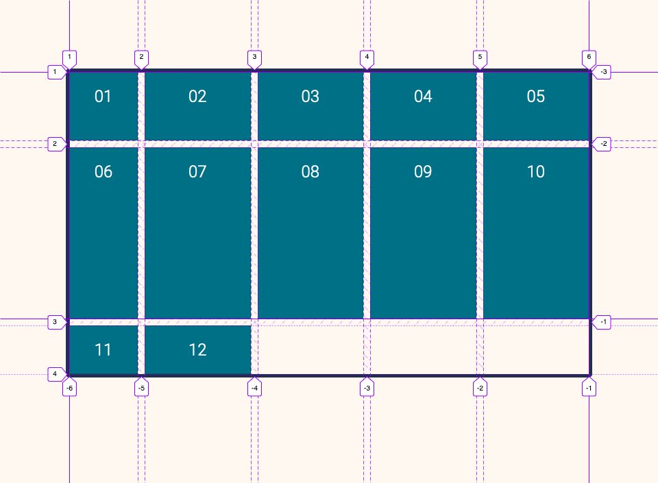

Ahora, si se desea que el elemento `01` ocupe las primeras 4 columnas, dicho elemento deberá ser afectado por un `class` y sobre él hacer algo así:

```css
.special {
	grid-column-start: 1;
	grid-column-end: 5;
	/* Shorthand ➜ grid-colum: 1 / 5 */

	background-color: #db637f;
}
```

*Resultado:*

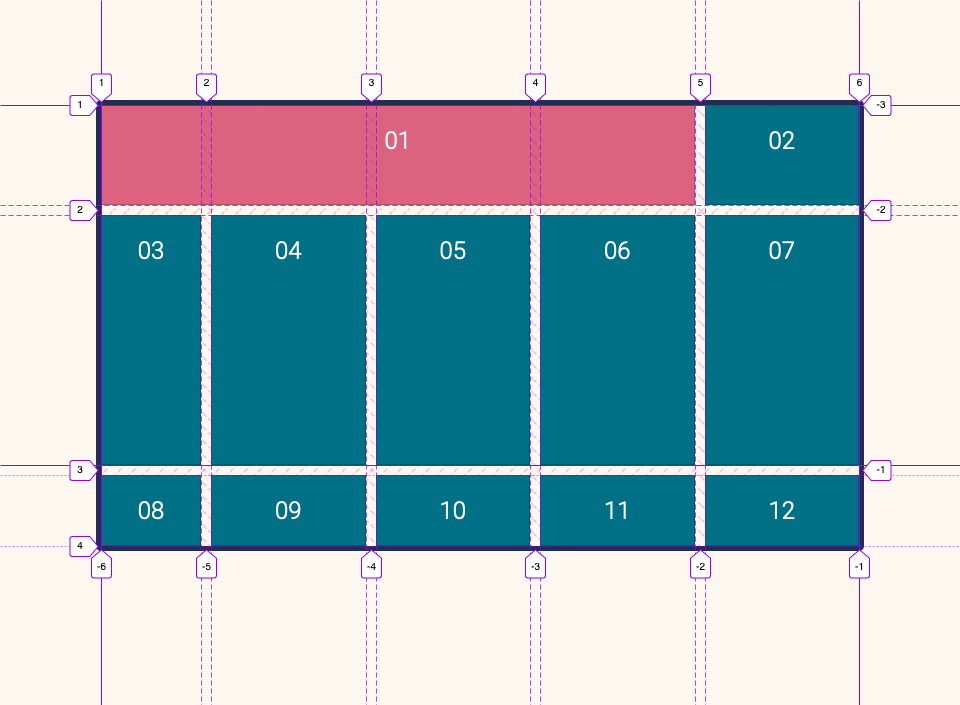

Cómo es obvio de pensar, si se desea que dicho elemento ocupe **todas** las 5 columnas, debería modificarse la regla así:

```css
.special {
	grid-column-start: 1;
	grid-column-end: 6;
	/* Shorthand ➜ grid-colum: 1 / 6 */

	background-color: #db637f;
}
```

*Resultado:*

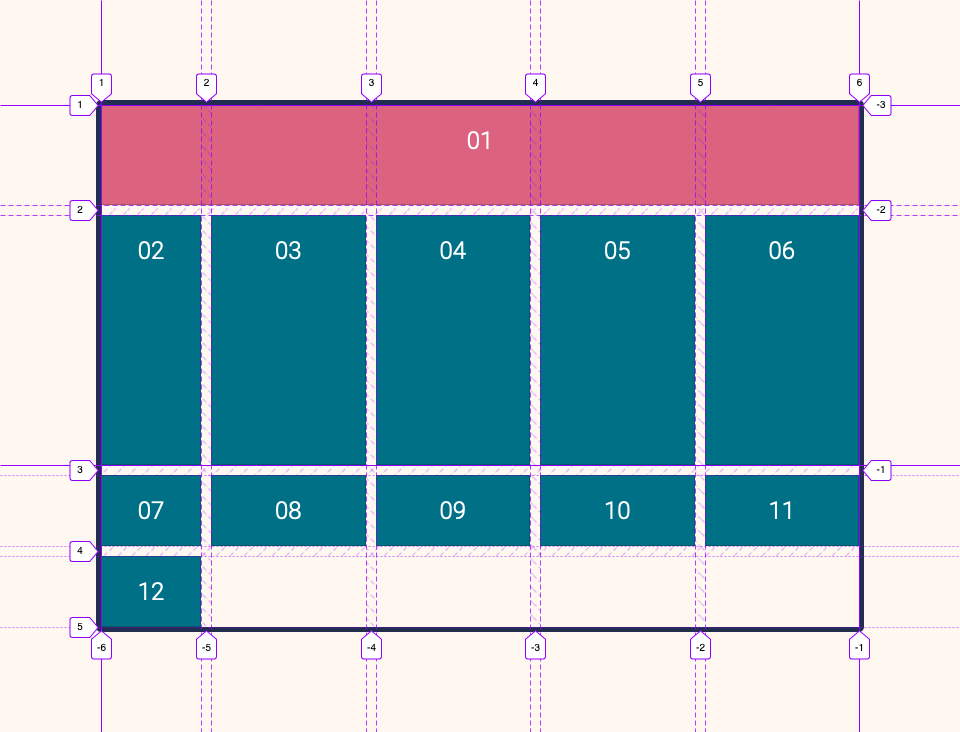

**⚠️ Warning:**

> Si se agregará una columna más al container, el elemento `special` solamente ocuparía las 6 primeras columnas. Es aquí donde es funcional aplicar `-1` en el fin del elemento (`grid-column: 1 / -1;`). Pues de derecha a izquierda la cuenta será negativa. Y de esta manera, indistintamente de la cantidad de columnas del *grid container*, este elemento siempre irá desde la columna número 1, hasta la número N.

Para el posicionamiento de elementos respecto a las filas, tiene el mismo funcionamiento. Solo que ahora se tomarán como referencia, los números ubicados de manera horizontal.

El siguiente código por ejemplo:

```css
.special {
	grid-column: 1 / -1;
	grid-row-start: 2;
	grid-row-end: 3;
	 /* Shorthand ➜ grid-row: 2 / 3;  */
	background-color: #db637f;
}
```

Implementará el siguiente resultado:

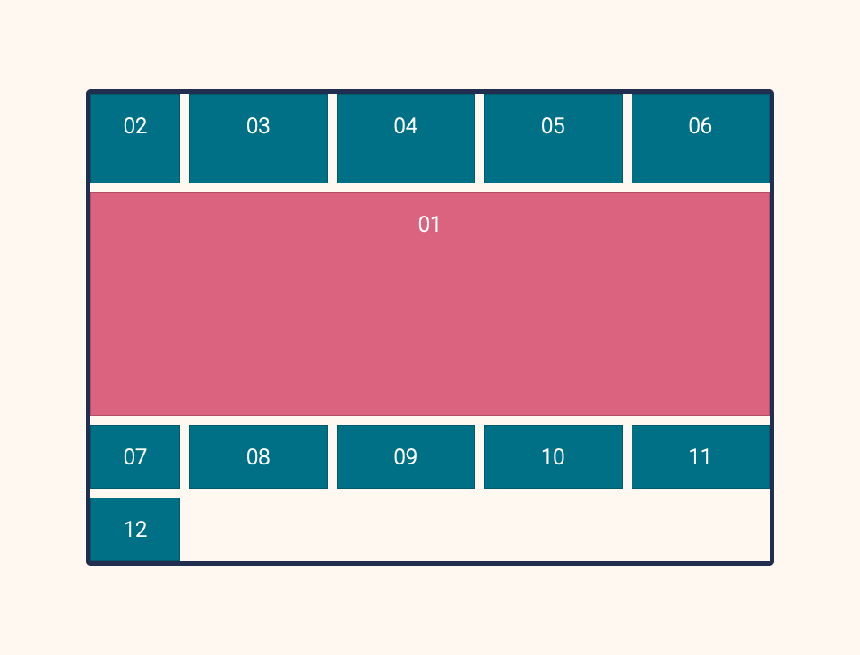

En este caso particular, el elemento `special` está ocupando desde la columna 1 hasta la última columna (cualquiera que esta fuere) y desde la fila 2 hasta la número 3.

**¿Por qué la fila queda tan alta? 🤔**
> Debido a que al momento de configurar al *grid container* se indicó que el alto de la segunda fila fuera de `250px`.

```css
.container {
	...
	grid-template-rows: 100px 250px;
}
```

[ volver al temario](#temario)

---

## 8. Grid Areas <a name="grid-areas"></a>

Las *grid areas* permiten generar espacios delimitados para posicionar elementos dentro de ellos. 

Para poder definir las areas se deberá usar la siguiente propiedad:

```css
grid-template-areas: string[s];
```

Dicha propiedad, recibe uno o varios strings de las áreas que se desean generar. 

Con el siguiente código:

```css
.container {
	display: grid;
	grid-template-columns: repeat(3, 1fr);
	gap: 10px;
	grid-template-areas: 
		'header 	header 		header'
		'sidebar 	content 	content'
		'sidebar 	content 	content'
		'footer 	footer 		footer'
	;
}
```
> la indentación no es obligatoria, solamente es por organización.

Se obtiene este resultado:

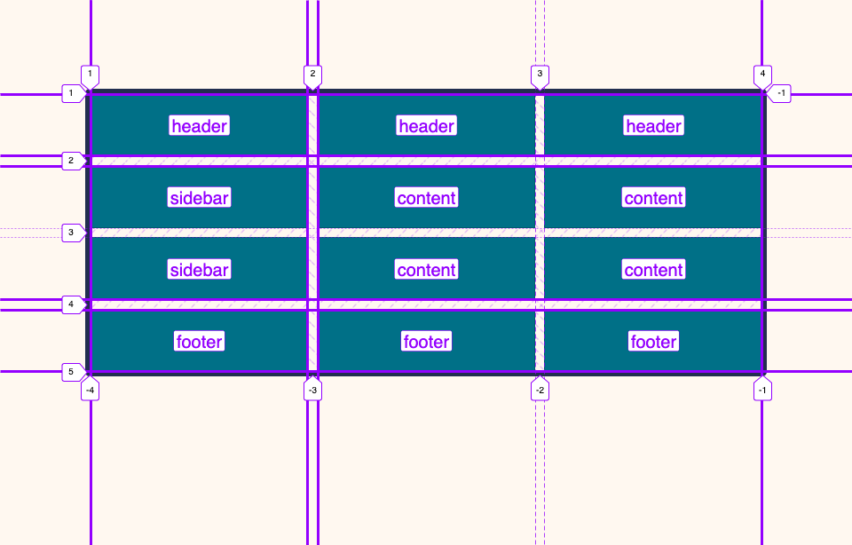

Una vez con las áreas definidas, se puede proceder a asignar a los elementos a sus determinadas con la propiedad `grid-area`, la cual toma como valor el nombre de área previamente definida.

Para ello, se hace necesario aplicar a cada elemento, un `class` para así poder modificar el mismo.

```html
<div class="container">
	<div class="header">01</div>
	<div class="sidebar">02</div>
	<div class="content">03</div>
	<div class="footer">04</div>
	<div>05</div>
	<div>06</div>
	<div>07</div>
	<div>08</div>
	<div>09</div>
	<div>10</div>
	<div>11</div>
	<div>12</div>
</div>
```

Notemos cómo los `divs` del 5 en adelante **NO** poseen un `class`. Esto se da, dado a que los mismos van a sobrar dentro de la grilla, después de asignar el resto de elementos a sus respectivas áreas.

Con esto hecho así:

```css
.header {
	grid-area: header; /* el valor, no va entre comillas */
	background-color: #db637f;
}

.sidebar {
	grid-area: sidebar; /* el valor, no va entre comillas */
	background-color: #222e50;
}

.content {
	grid-area: content; /* el valor, no va entre comillas */
	background-color: #ffe882
}

.footer {
	grid-area: footer; /* el valor, no va entre comillas */
	background-color: #542344
}
```

El resultado será el siguiente:

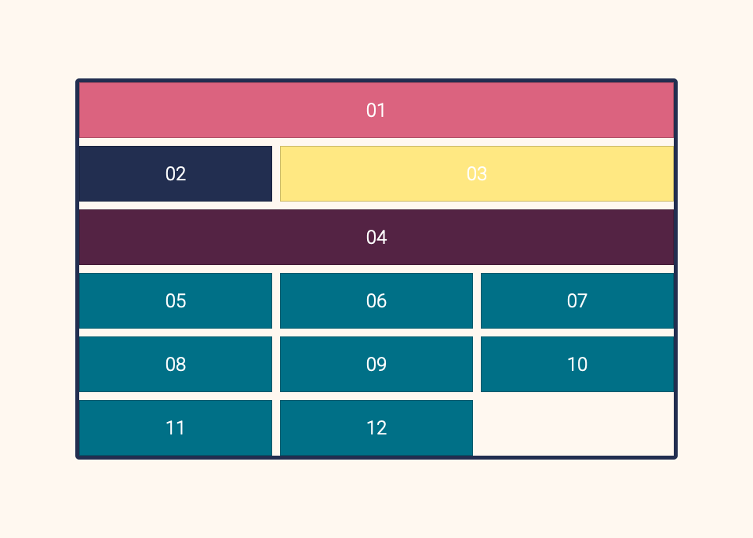

Lo único que resta hacer es eliminar el contenido `html` restante.

```html
<div class="container">
	<div class="header">01</div>
	<div class="sidebar">02</div>
	<div class="content">03</div>
	<div class="footer">04</div>
</div>
```

Y se obtendría un resultado así:

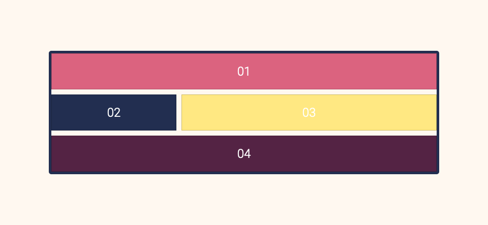

En este escenario, al no haber declarado explicitamente la propiedad `grid-template-rows`, cada fila podrá *"crecer"* en su tamaño de alto, según como su contenido lo disponga

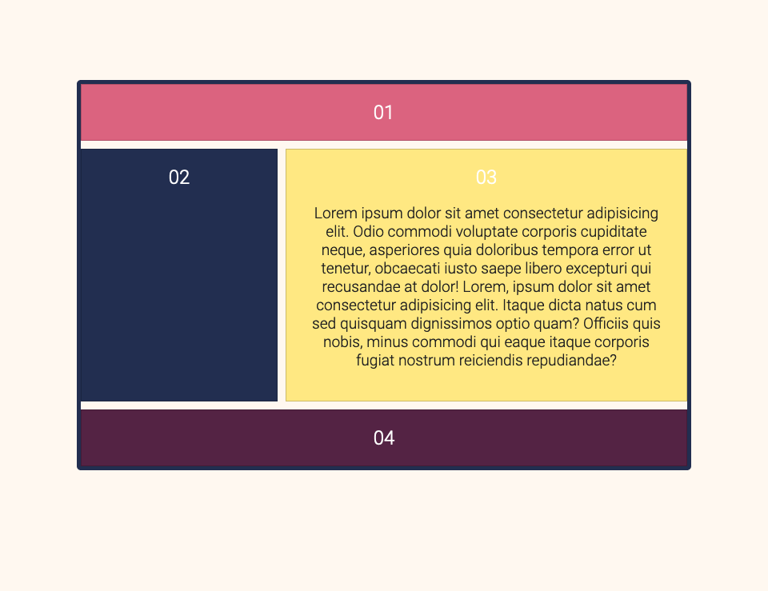

[ volver al temario](#temario)

---

## 9. Alineación de elementos <a name="alineación-de-elementos"></a>

CSS grid permite alinear los elementos en relación a las columnas y filas creadas. Para ello se pueden usar las siguientes propiedades en la regla que afecta al *parent container*:

```css
/* Alineación Horizontal */
justify-items: value; 

/* Alineación Vertical */
align-items: value; 

/* Valores posibles: stretch | auto | start | end | center */
```

Los anteriores valores se podrán combinar según como sea necesario para lograr el resultado esperado.

*Ejemplo con `justify-items: stretch; y align-items: start;`*

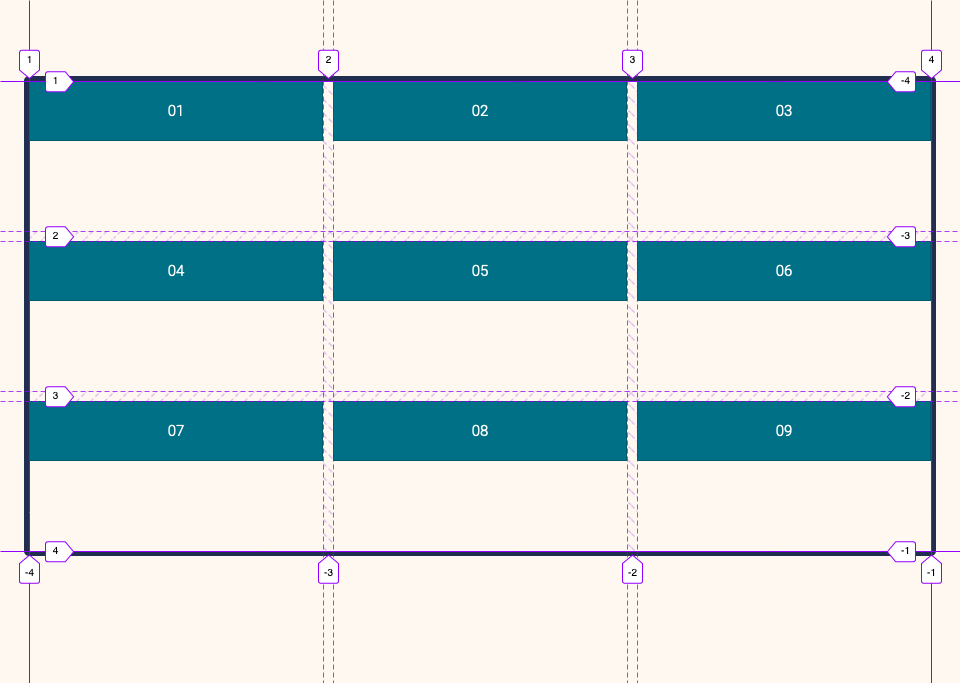

*Ejemplo con `justify-items: center; y align-items: center;`*

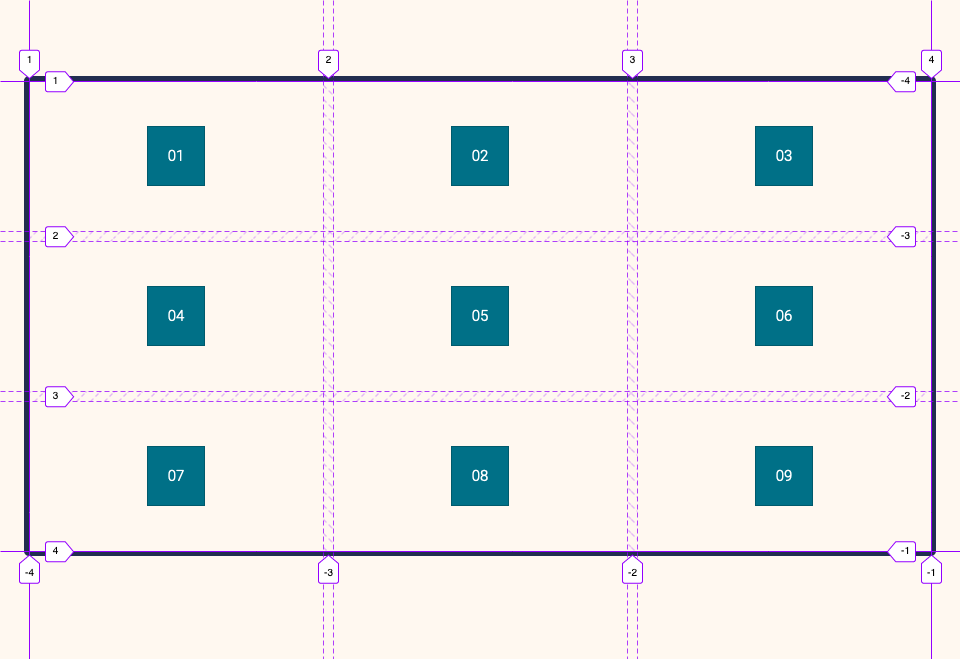

> Es importante tener en cuenta que cada uno de estos valores surtirá efecto SOLAMENTE dentro de intersección entre fila y columna en la que se encuentra el elemento.

Así mismo es posible alinear un solo `item` dentro de su correspondiente espacio.

```css
.special {
	justify-self: stretch; /* Alineación Horizontal */
	align-self: end; /* Alineación Vertical */
	background-color: #542344;
}
```
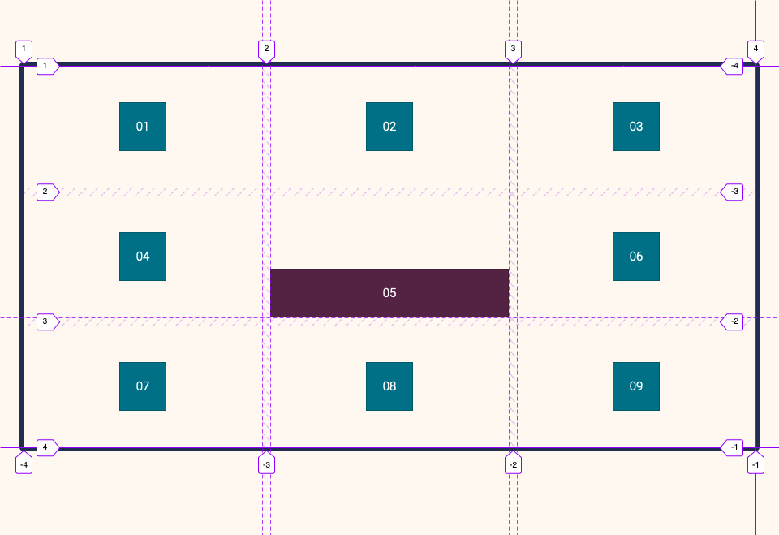

[ volver al temario](#temario)

--- 

## 10. Alineación de tracks <a name="alineación-de-tracks"></a>
Muy parecido al punto anterior, CSS grid permite alinear todos los elementos en relación al *parent container*. Para ello, las propiedades que se pueden usar, las cuales van en la regla del *parent container*, son:

```css
/* Alineación Horizontal */
justify-content: value; 

/* Alineación Vertical */
align-content: value; 

/* Valores posibles: start | end | center | space-around | space-between | space-evenly */
```

Teniendo el siguiente código:

```css
.container {
	...
	height: 600px;
	/* Grid System */
	display: grid;
	gap: 10px;
	grid-template-columns: repeat(3, 150px);
	grid-template-rows: repeat(3, 150px);
}
```

El resultado sería el siguiente:

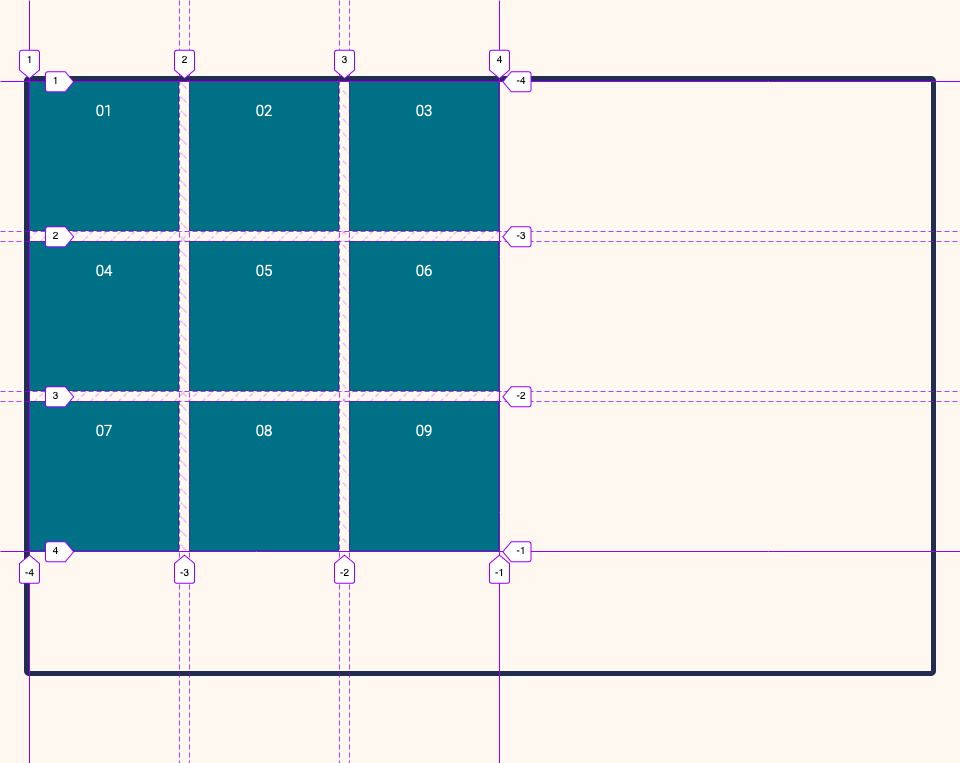

Como se puede apreciar, el contenedor tiene espacio de sobra, tanto en el eje horizontal así como también en el eje vertical. Y en este tipo de escenarios es donde se hace funcional la alineación de contenido.

*Ejemplo:* con el siguiente código adicional:

```css
.container {
	...
	/* Alineación de contenido */
	justify-content: center; /* Horizontal */
	align-content: center; /* Vertical */
}
```

*El resultado sería el siguiente:*

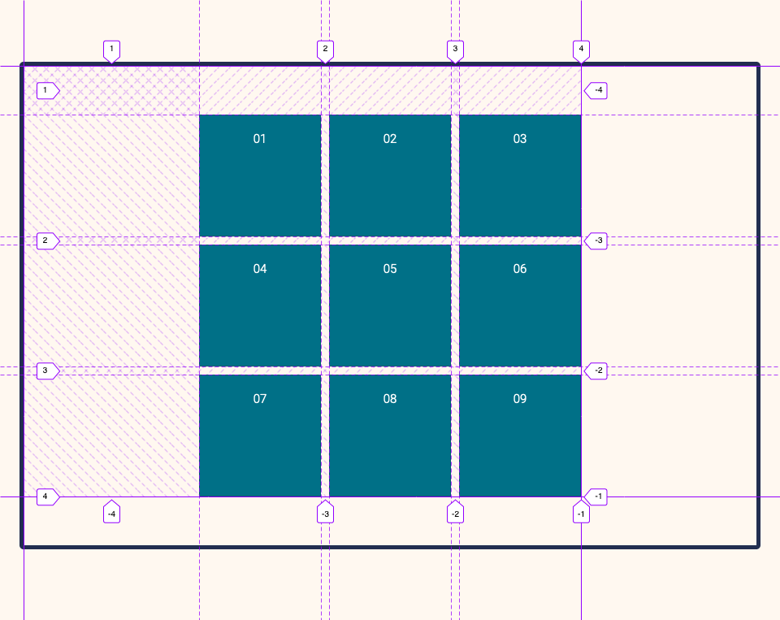

Pudiendo lograr muchas otras combinaciones más:

*`justify-content: space-evenly; align-content: space-evenly;`*

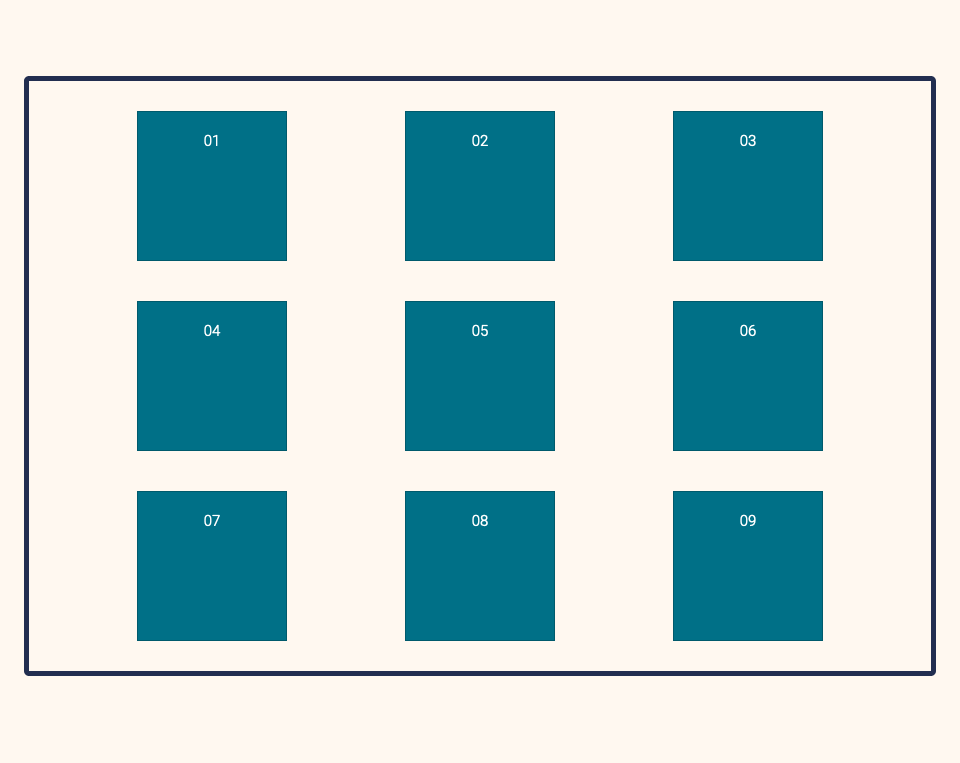

*`justify-content: space-between; align-content: space-between;`*

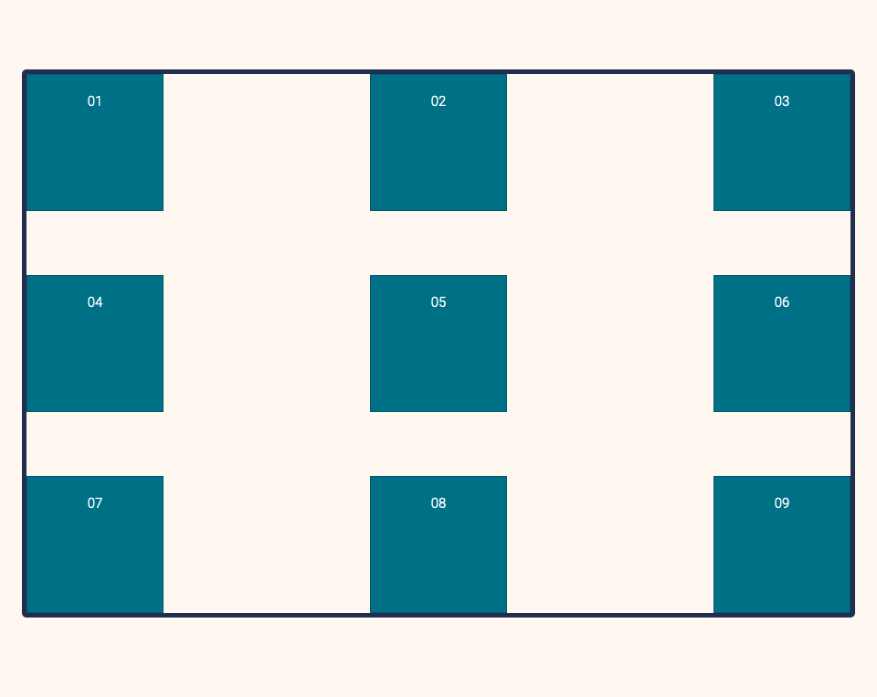

[ volver al temario](#temario)

---

## 11. Grid flow <a name="grid-flow"></a>

Dentro de un esquema de CSS Grid es posible cambiar la orientación de los elementos. Para ello se nos provee de la siguiente propiedad:

```css
grid-auto-flow: value;
/* Valores posibles: row | column | dense */
```

Por defecto, dicha propiedad viene con el valor `row`. El cual define que los elementos dentro del *parent container* inicien de derecha a izquierda.

Sin embargo, si se quisiera que los elementos iniciaran de arriba a abajo el valor `column` efectuaría dicho resultado.

```css
.container {
	/* Grid System */
	display: grid;
	gap: 10px;
	grid-template-columns: repeat(3, 1fr);
	grid-template-rows: repeat(3, 150px);
	grid-auto-flow: column;
}
```

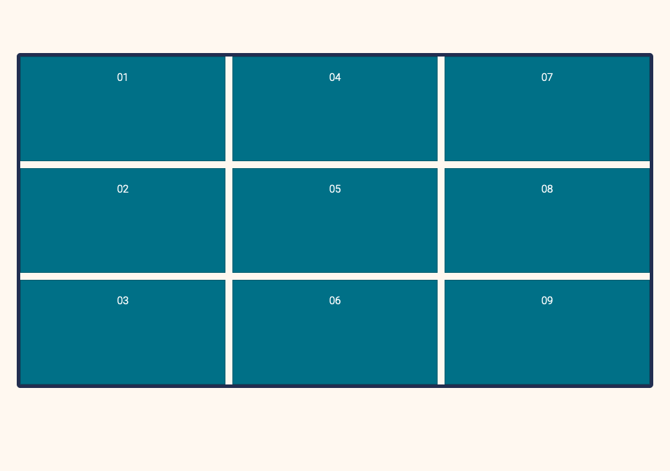

En ocasiones es posible tener elementos que ocupen una `N` cantidad de columnas y dependiendo de ello, es posible que algunas celdas queden vacías.

Con el siguiente código:
```html
<div class="container">
	<div>01</div>
	<div class="span2">02</div>
	<div>03</div>
	<div class="span3">04</div>
	<div>05</div>
	<div>06</div>
	<div class="span3">07</div>
	<div>08</div>
	<div>09</div>
</div>
```

```css
.container {
	/* Grid System */
	display: grid;
	gap: 10px;
	grid-template-columns: repeat(3, 1fr);
	grid-template-rows: repeat(3, 150px);
	grid-auto-flow: row;
}

.span2 {
	grid-column: span 2; /* define que el elemento ocupe 2 columnas */
	background-color: #542344;
}

.span3 {
	grid-column: span 3; /* define que el elemento ocupe 3 columnas */
	background-color: #db637f;
}
```

Se obtiene:

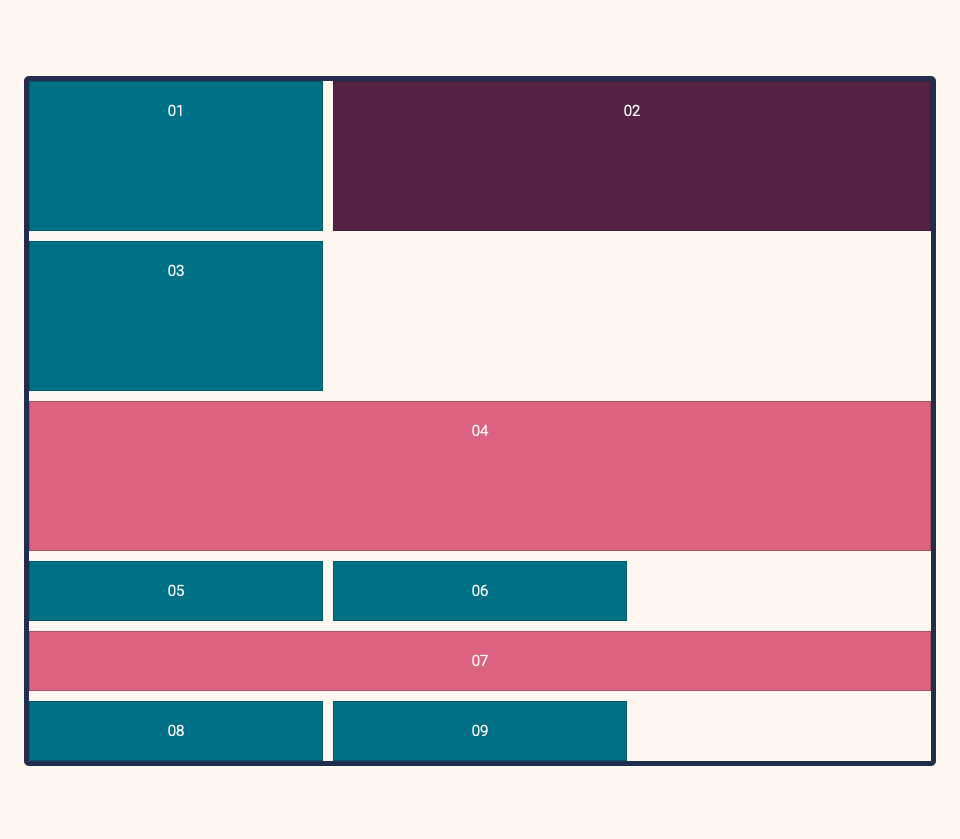

Es en estos escenarios es donde el valor `dense` cobra bastante utilidad, pues el mismo permite que esas celdas vacías sean rellenadas de manera automática por el navegador.

```css
.container {
	...
	/* grid-auto-flow: row; cambia por: */
	grid-auto-flow: row dense;
}
```

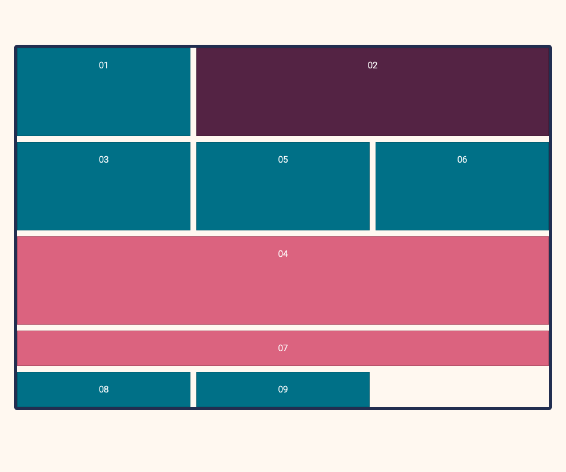

[ volver al temario](#temario)

---

## 12. Auto Fill & Auto Fit <a name="auto-fill-fit"></a>

Estos dos valores permiten definir el comportamiento de los elementos al momento de implementar el *"responsiveness"* del *parent container*. Pues lo mismos tratarán de disponer los elementos de la mejor manera posible en función de su elemento contenedor.

Para ello se podría configurar el *parent container* con sus correspondientes columnas así:

```css
grid-template-columns: repeat(auto-fit, minmax(X, 1fr));
/* ó */
grid-template-columns: repeat(auto-fill, minmax(X, 1fr));
```

`auto-fit` por un lado. Le indicará a los elementos que se deben disponer uno debajo del otro si es que el ancho del *parent container* no es el suficiente. Pero que mientras sea posible, todos los elementos que puedan entrar en una sola fila, lo hagan sin dejar espacios sobrantes más que los dispuestos por la propiedad `gap`.

Por otro lado `auto-fill`, quien se parece al anterior valor en primera medida. Le indica a los elementos que el tamaño de ancho de los mismos deberá mantenerse sin modificaciones, más aún de que exista un espacio de sobra dentro del contenedor.

La mejor manera de entender este concepto que es un poco abstracto. Es viendo el mismo en acción:

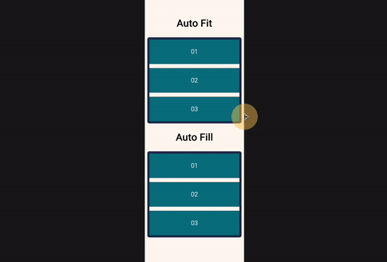

[ volver al temario](#temario)

---

**Made with ❤️ by: [Javi Herrera](https://javier-herrera.com)**

*Si te parece interesante este tipo de contenido, puedes agradecerme con un Follow en mis siguientes redes sociales. Lo estimaría un montón.*

[](https://www.linkedin.com/in/japsolo/)
[](https://www.instagram.com/thefullstackdevs/)
[](https://open.spotify.com/show/3J2dLuBSfzt9VVnEF8q18a)